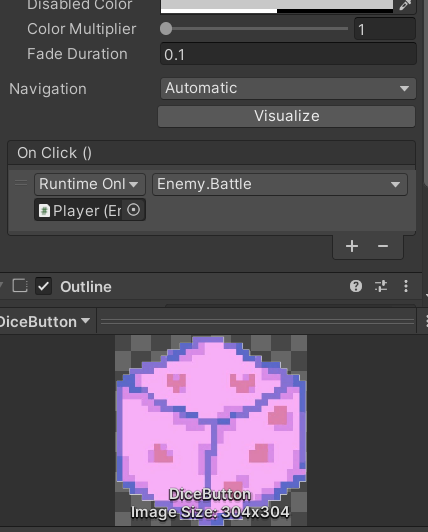
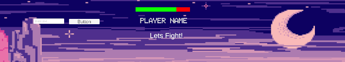
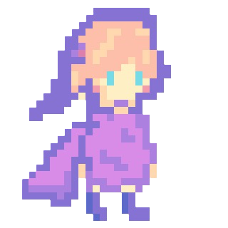

# RPG - Potion Escape

<br>Keisha Byrne</br>
2401317
<br>Fundamentals Of Games Development</br>

# Research

### What research did you do?

## Dice 
I wanted the player to have to roll a dice to see how much attack they can deal an enemy. The score they recieve from their roll would be added onto their already existing attack.  

With these ideas in mind, I started to search up the code "random.range" (Technologies, n.d.) to be able to grasp more of an understanding on how that code works so that I could then apply that to my project. I used a mixture of unitys manual (Technologies, n.d.) and chatgpt to help me on this. 

My game idea for this project is heavily influenced by Stardew Valley (Stardewvalley.net, 2016) so I also took the time to research the game in detail to be able to keep some aspects of the game in my project but also trying to keep it unique and personal to me. For example, there are mines in stardew valley where the player has to fight enemies. In my project I wanted to have a mine aspect too where enemies are found to fight but the player must roll a dice to see how much damage they do to enemy. This adds a dnd feel to the game and makes it more personal to me. 

## Battle system 

When thinking of what enemy I wanted for my game, I searched up 2d pixel art enemies and came across these slimes. I took some inspiration from these by keeping the enemy the same size but I wanted my enemy to represent a potion inside of a magic bottle. This kept it on the same theme of the witchy, magic battle scene. 

## Game loop 
My game loop is kept simple as I prefer a more casual style type of game so keeping it simple makes it fit this more. The game loop is to kill the enemy by rolling the dice. The player and the enemy go up against eachother and its a battle to see who will win. If the player wins then the game restarts and it says on the screen. I wanted the player to be able to see the damage being done to both the player and enemy as well.

### How did it help?
Unitys manual (Technologies, n.d.) helped me understand this line of code because it included code snippets and highlights the key terms being used so I understood it clearer. However, I preferred using ChatGPT as it broke it down a lot more whilst also including code snippets. I could also ask for it to be simplified even more and summarised. 

# How Did I Make It?

### Dice
I made this project by simply writing out the code for all three dice and I ran it to make sure that it worked. The code meant that all three dice were rolled at the same time and I wanted to change that to fit more in with my project. I done this by seperating the dice code into three individual sections. I then referenced that specific code on the dice in the game so that it would only use D20 as that fits in with my game idea. 

### Battle system / game loop
I made a health bar for both the enemy and the player so the player can see the damage being done each time, along with the damage coming up on the screen when the dice is rolled each time. I made the enemys health 20 and the players health 100 so that there would be a higher chance of the player winning. I also changed the colour of the health bar for the enemy so the player can understand its linked to the enemy and not just a random health bar. I placed the players health bar above the name section and I placed the enemys health bar above its head. I also made it so that if the players health is below 0 then the death text comes up on the screen and the game ends. 

# Outcome (The Final Product)

## Dice 
``` csharp 
using System.Collections;
using System.Collections.Generic;
using UnityEngine;

public class Dice : MonoBehaviour
{
    public int diceRoll;

    public void RollD6()
    {
        int result = Random.Range(1, 7);
        Debug.Log("rolled a d6: " + result);
        diceRoll = result;
    }

    public void RollD12()
    {
        int result = Random.Range(1, 13);
        Debug.Log("rolled a d12: " + result);
        diceRoll = result;
    }
    public void RollD20()
    {
        int result = Random.Range(1, 21);
        Debug.Log("rolled a d20: " + result);
        diceRoll = result;
    }
}
```
<br>
This code snippet shows how I organised all of the dice code in Unity so I would be able to reference them individually when needed. This code translates to when the dice is rolled it will return a number between a range of 0-20 using the random range code. When the number is randomly changed the debug log will show a message saying that the dice has been rolled and it will include the result it has given. The line underneath it will then return that number for my project to be able to use it for the players attack. </br>

# Damage 
```csharp
    // attack damage dealt by the player
        public int GetDamage()
        {
            dice.RollD20();
            int tempattack = attack + dice.diceRoll;
            DamageText.displaydamage(tempattack);
            return tempattack;
        }
    }
}
```
<br>
In this code snippet, it shows how the player uses the dice to be able to add the result on their attack and it then shows that number as the final result of the dice being rolled. This is used in the battle element of my game so i named this GetDamage to show that the enemy will be getting this result as damage. 
</br>


<br>
In this snippet, it shows how I referenced the enemy battle script. I used this script as a reference instead of the dice as it makes sure that the result adds on to the players attack rather than just rolling a dice and getting a number. I made the dice code into a button and changed that to look like a 2d dice as it fitted in more with the style of game i want to do and i feel like its more user intutive. 
</br>


<br>
This snippet shows the code working when the user rolls the dice. 
</br> 

## Battle system / game loop 


```csharp
public class HealthManager : MonoBehaviour
{
    public Slider hBar;
    public float healthAmount = 100f;

    public void TakeDamage(float damage)
    {
        healthAmount -= damage;
        var v = healthAmount / 100f;
        Debug.Log(gameObject.name + " Took " + damage + " damage!");
        Debug.Log(gameObject.name + " Health is " + healthAmount);
        hBar.value = v;
```

<br>
In this snippet, it shows the code for the health bar and how much its equal to. Then underneath it shows the code for when the player takes damage from the enemy and the debug logs explaining the damage taken and the health amount left.

</br>


```csharp
  if(healthAmount <= 0f)
        {
            Debug.Log("Oh no! " + gameObject.name + " is dead!");
            Destroy(gameObject); 

            if (gameObject.CompareTag("Player"))
            {
                SceneManager.LoadScene(SceneManager.GetActiveScene().name);
            }
            else
            {
                Debug.Log("You Win! Yay!");
           
            }
```
<br>
In this snippet, it shows the code for what happens when the players health is less than 0, which in this case causes the player to die. The line after codes for the game restarting if the player dies and if the player doesnt die then the words you win come up on the debug log. 

</br>

 

```csharp
using System.Collections;
using System.Collections.Generic;
using UnityEngine;
using PlayerNS;
using TMPro;
namespace Damage
{
    public class Damage : MonoBehaviour
    {
        public TMP_Text DamageText;

        public void displaydamage(int attack)
        {
            DamageText.text ="-" + attack.ToString();
        }
    }
}
```

<br>
These snippets show the health bars in my project and them working during the game. It also shows the damage being done on the screen above the player and the enemy. I used the same script for these and I copied the text and renamed them so that it was easier to understand what damage was linked to either the player or the enemy. The code snippet shows the code I used to make the damage appear on the screen of the game. 

</br>

```csharp
  public void Battle()
        {
            // this is setting the text of UI text
            StartingText.text = "Lets Fight!";
            Debug.Log("Lets Fight!");
            opponent.GetComponent<HealthManager>().TakeDamage(GetDamage());
            gameObject.GetComponent<HealthManager>().TakeDamage(opponent.GetDamage());
        }
```


<br>
This code snippet shows the starting text when the game is first played. At the top of the screen it says Lets fight which I felt was a cute touch to the game and then the code underneath it is referencing the enemy and the player causing eachother damage. 

</br>

[Git Repository](https://github.com/kdogz9/RPG-Project)


# Reflection

This project went well towards the end. I struggled to understand the code at first so I had to break down the code a lot more to be able to understand what each line was doing in the dice script. This seemed to help me a lot more and I also looked at documentation which explained each line of code as well. 

I struggled to start the project but once I saw how simple it was I managed to get stuck into it. There were a lot of errors during this code as I added extra things into my game to make it more personal but these taught me a lot during this project. 

If I was to do this again, I would break down everything I need to do for the project into smaller steps so that it would prevent me from procrastinating and feeling overwhelmed. I also now know what type of documentation is useful to me so I can use this type of documentation for my future projects which should help them run a bit more smoothly. 

# Bibliography

<br>Technologies, U. (n.d.). Unity - Scripting API: Random.Range. [online] docs.unity3d.com. Available at: https://docs.unity3d.com/ScriptReference/Random.Range.html. (Accessed 21/10/24) </br>

<br>ConcernedApe (2016). Stardew Valley. [online] Stardewvalley.net. Available at: https://www.stardewvalley.net/. (Accessed 21/10/24)</br>

# Declared Assets

Freepik. (2022). Free Vector | Pixel art mystical background. [online] Available at: https://www.freepik.com/free-vector/pixel-art-mystical-background_29019077.htm [Accessed 3 Dec. 2024].

‌

<br> The only asset I didnt make was the background since that would have been too time consuming but I did make the player, the enemy and the dice myself using a pixel art app. </br>

 


https://youtu.be/4RKrzFUSyAc 

[Itch.io] (https://starcreations.itch.io/potion-escape)


The Following assets/scripts were created or modified with the use of ChatGPT 4o:

- HealthManager.cs